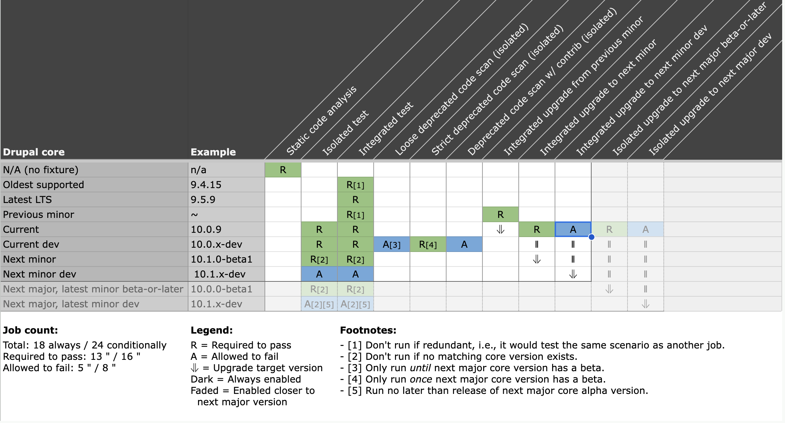

# Understanding ORCA

1. [The basics](#the-basics)
1. [Test fixtures](#test-fixtures)
1. [Static analysis](#static-analysis)
1. [Automated tests](#automated-tests)
1. [Continuous integration](#continuous-integration)

## The basics

At its heart, ORCA is a [Symfony Console](https://symfony.com/doc/current/components/console.html) application. It requires PHP, Composer, SQLite (which it uses to avoid a MySQL requirement on the host), and Git. It expects to be installed in a directory adjacent to the [system under test (SUT)](glossary.md#sut). It creates its [test fixtures](glossary.md#test-fixture) under the same parent, e.g.:

 ```
 .
 └── Projects
     ├── example     # The system under test (SUT)
     ├── orca        # ORCA itself
     └── orca-build  # The test fixture
 ```

Note: The fixture directory can be changed at runtime via [environment variable](advanced-usage.md#ORCA_FIXTURE_DIR).

## Test fixtures

An ORCA test fixture is comprised of a [BLT](glossary.md#blt) project with one or all company software packages (as specified by default in [`config/packages.yml`](../config/packages.yml) and configurable via [environment variables](advanced-usage.md#ORCA_PACKAGES_CONFIG)) added via Composer. There are two basic kinds:

* A **standard fixture** includes and installs the SUT as well as all other company packages.
* A **SUT-only fixture** includes and installs the SUT and omits all other non-required company packages.

Packages are included at one of two levels of stability:

* Their **recommended, stable** versions.
* Their **development** (dev/HEAD) versions.

ORCA uses [path repositories](https://getcomposer.org/doc/05-repositories.md#path) to make Composer install the system under test (SUT) from the local directory. Merely composing the test fixtures can reveal many quality and interoperability issues.

## Static analysis

ORCA checks the SUT for low level construction defects using the following static analysis tools:

* [Composer validate](https://getcomposer.org/doc/03-cli.md#validate) checks `composer.json` files for validity and completeness.
* [Composer normalize](https://github.com/localheinz/composer-normalize) checks `composer.json` files for consistent ordering and formatting.
* [PHP Parallel Lint](https://github.com/JakubOnderka/PHP-Parallel-Lint) checks PHP files for syntax errors.
* [Acquia Coding Standards for PHP](https://github.com/acquia/coding-standards-php) checks for coding standards and best practices compliance, checks for PHP cross-version compatibility with all supported language versions, and finds vulnerabilities and weaknesses related to security in PHP code.
* [PHPLOC](https://github.com/sebastianbergmann/phploc) measures the size and analyzes the structure of a PHP project, including such low level metrics as cyclomatic complexity and dependencies. ([Example.](https://github.com/sebastianbergmann/phploc#usage-examples))
* [PHP Mess Detector](https://phpmd.org/) looks for potential problems in PHP source code, such as possible bugs, suboptimal code, overcomplicated expressions, and unused parameters, methods, and properties.
* The [Symfony YAML Linter](https://symfony.com/doc/current/components/yaml.html) checks YAML files for syntax errors.

Static analysis requires no special setup of the SUT.

## Automated tests

ORCA tests for functional and behavioral correctness with [PHPUnit](glossary.md#phpunit) and [Nightwatch.js](glossary.md#nightwatchjs).

* An **integrated test** exercises the SUT in the _presence_ of all other company packages (i.e., in a standard fixture) to ensure that all packages can be added to the same codebase via Composer and that there are no install time or functional conflicts between them.
* An **isolated test** exercises the SUT in the _absence_ of other non-required packages (i.e., in a SUT-only fixture) to ensure that it has no undeclared dependencies on other packages and functions correctly on its own.

See [Running automated tests](getting-started.md#running-automated-tests).

## Continuous integration

ORCA includes out-of-the-box support for Travis CI for continuous integration. The default implementation runs the following concurrent jobs per build:



- `STATIC_CODE_ANALYSIS` - Static code analysis
- `INTEGRATED_TEST_ON_OLDEST_SUPPORTED` - Integrated test on oldest supported Drupal core version
- `INTEGRATED_TEST_ON_LATEST_LTS` - Integrated test on latest LTS Drupal core version
- `INTEGRATED_TEST_ON_PREVIOUS_MINOR` - Integrated test on previous minor Drupal core version
- `INTEGRATED_UPGRADE_TEST_FROM_PREVIOUS_MINOR` - Integrated upgrade test from previous minor Drupal core version
- `ISOLATED_TEST_ON_CURRENT` - Isolated test on current Drupal core version
- `INTEGRATED_TEST_ON_CURRENT` - Integrated test on current Drupal core version
- `INTEGRATED_UPGRADE_TEST_TO_NEXT_MINOR` - Integrated upgrade test to next minor Drupal core version
- `INTEGRATED_UPGRADE_TEST_TO_NEXT_MINOR_DEV` - Integrated upgrade test to next minor dev Drupal core version
- `ISOLATED_TEST_ON_CURRENT_DEV` - Isolated test on current dev Drupal core version
- `INTEGRATED_TEST_ON_CURRENT_DEV` - Integrated test on current dev Drupal core version
- `LOOSE_DEPRECATED_CODE_SCAN` - Loose deprecated code scan
- `STRICT_DEPRECATED_CODE_SCAN` - Strict deprecated code scan
- `DEPRECATED_CODE_SCAN_W_CONTRIB` - Deprecated code scan w/ contrib
- `ISOLATED_TEST_ON_NEXT_MINOR` - Isolated test on next minor Drupal core version
- `INTEGRATED_TEST_ON_NEXT_MINOR` - Integrated test on next minor Drupal core version
- `ISOLATED_TEST_ON_NEXT_MINOR_DEV` - Isolated test on next minor dev Drupal core version
- `INTEGRATED_TEST_ON_NEXT_MINOR_DEV` - Integrated test on next minor dev Drupal core version
- `ISOLATED_TEST_ON_NEXT_MAJOR_LATEST_MINOR_BETA_OR_LATER` - Isolated test on next major, latest minor beta-or-later Drupal core version
- `INTEGRATED_TEST_ON_NEXT_MAJOR_LATEST_MINOR_BETA_OR_LATER` - Integrated test on next major, latest minor beta-or-later Drupal core version
- `ISOLATED_TEST_ON_NEXT_MAJOR_LATEST_MINOR_DEV` - Isolated test on next major, latest minor dev Drupal core version
- `INTEGRATED_TEST_ON_NEXT_MAJOR_LATEST_MINOR_DEV` - Integrated test on next major, latest minor dev Drupal core version
- `ISOLATED_UPGRADE_TEST_TO_NEXT_MAJOR_BETA_OR_LATER` - Isolated upgrade test to next major beta-or-later Drupal core version
- `ISOLATED_UPGRADE_TEST_TO_NEXT_MAJOR_DEV` - Isolated upgrade test to next major dev Drupal core version

See [Configuring Travis CI](getting-started.md#configuring-travis-ci).

---

[README](README.md)
| **Understanding ORCA**
| [Getting Started](getting-started.md)
| [CLI Commands](commands.md)
| [Advanced Usage](advanced-usage.md)
| [Project Glossary](glossary.md)
| [FAQ](faq.md)
| [Contribution Guide](CONTRIBUTING.md)
